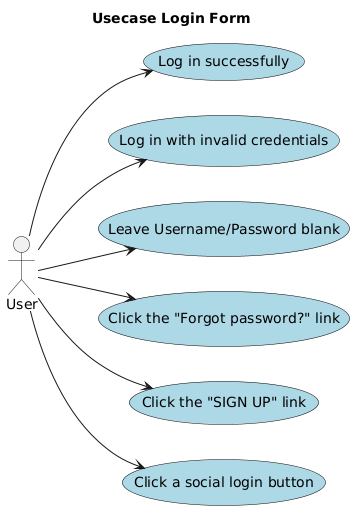

# LAB03-LOGIN-FORM

## 1. Giới thiệu  
Dự án **LAB03-LOGIN-FORM** là ví dụ về một form đăng nhập đơn giản với các tính năng cơ bản:  
- Đăng nhập thành công  
- Đăng nhập với thông tin sai  
- Bỏ trống username/password  
- Liên kết “Forgot password?”  
- Liên kết “SIGN UP”  
- Đăng nhập qua nút mạng xã hội  
Dự án sử dụng HTML, Python (Flask hoặc framework tùy bạn triển khai) và các tập tin hỗ trợ khác.
  
## 2. Mô tả ngắn các files
- **login.html**: giao diện form gồm các trường username, password, các nút đăng nhập, liên kết quên mật khẩu, đăng ký, và các nút mạng xã hội  
- **dashboard.html**: trang đích nếu người dùng đăng nhập thành công  
- **forgot_password.py**: logic xử lý khi người dùng nhấn “Forgot password?”  
- **signup.py**: logic xử lý đăng ký người dùng mới  
- **social_buttons.py**: logic đăng nhập thông qua các nút mạng xã hội (ví dụ: Google, Facebook)  
- **usecase_loginform.png**: sơ đồ Use Case minh họa các tương tác của người dùng  

## 3. Hướng dẫn chạy dự án
1. Cài đặt môi trường Python (ví dụ Python 3.x).  
2. Cài đặt các thư viện cần thiết (nếu có). Ví dụ (nếu dùng Flask):
  ```bash
  pip install flask
  ```
3. Chạy ứng dụng:
  ```bash
  python login.py
  ```
hoặc file chính mà bạn dùng để khởi chạy server.

4. Mở trình duyệt, truy cập địa chỉ (ví dụ) http://localhost:5000/login để xem form đăng nhập.
5. Thử các chức năng:
- Nhập đúng username/password → được chuyển đến dashboard.html
- Nhập sai → hiện thông báo lỗi
- Bỏ trống → hiện cảnh báo
- Nhấn “Forgot password?” → chuyển sang xử lý forgot_password.py
- Nhấn “SIGN UP” → chuyển qua signup.py
- Nhấn nút mạng xã hội → logic xử lý trong social_buttons.py

## 4. Tính năng & luồng chính
Tình huống	Kết quả mong đợi
Đăng nhập đúng	Vào trang Dashboard
Đăng nhập sai	Hiện thông báo “Invalid credentials”
Bỏ trống username/password	Hiện cảnh báo “Please fill in username/password”
Nhấn “Forgot password?”	Chuyển đến trang xử lý quên mật khẩu
Nhấn “SIGN UP”	Chuyển đến form đăng ký
Nhấn nút mạng xã hội	Xử lý đăng nhập qua mạng xã hội tương ứng

## 5. Sơ đồ Use Case

  

Use case thể hiện các tương tác của User với hệ thống (đăng nhập thành công, đăng nhập sai, bỏ trống, forgot password, sign up, social login).
